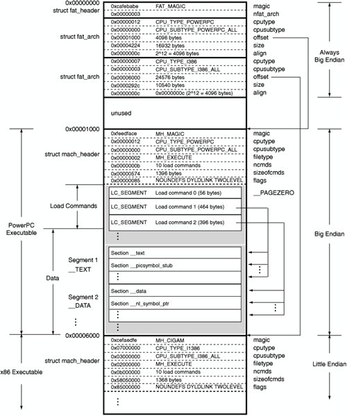
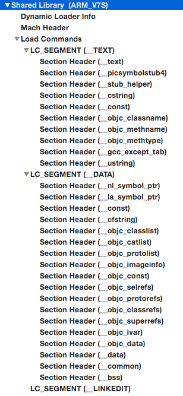
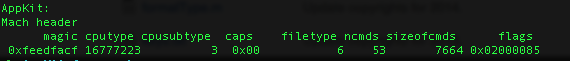
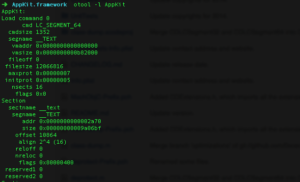
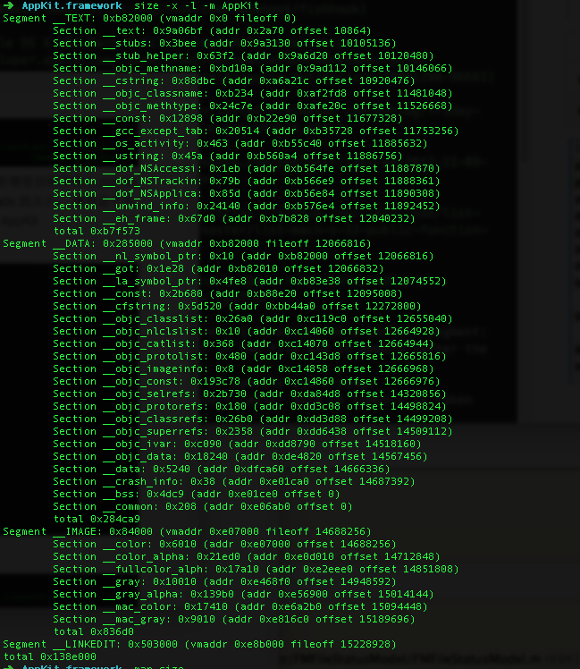
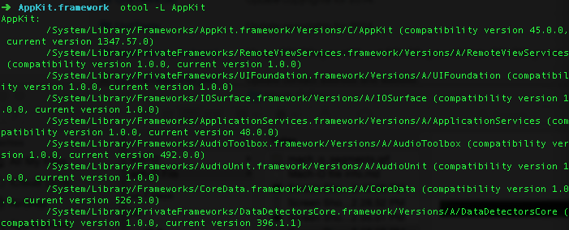
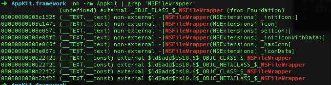
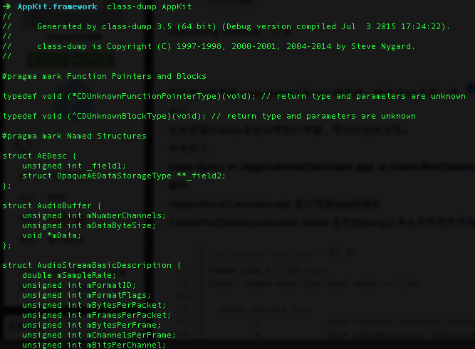
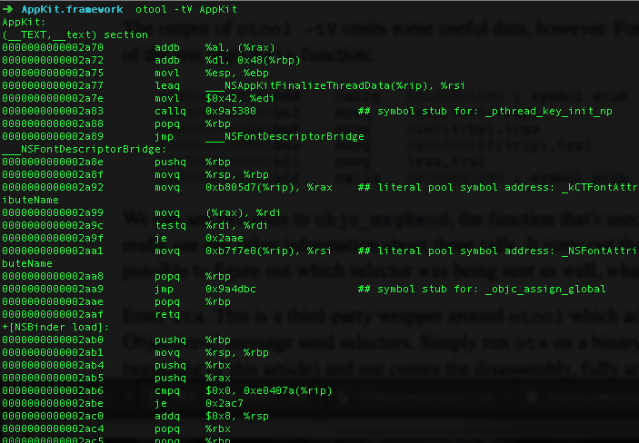

#Mach-O

[Mach-O](https://zh.wikipedia.org/wiki/Mach-O)为Mach Object文件格式的缩写，它是一种用于可执行文件，目标代码，动态库，内核转储的文件格式。作为a.out格式的替代，Mach-O提供了更强的扩展性，并提升了符号表中信息的访问速度。

##Mach-O 文件结构

可以下载**[MachOView](https://github.com/gdbinit/MachOView)**工具查看Mach—O 文件结构。

> * __PAGEZERO 它的大小为 4GB。这 4GB 并不是文件的真实大小，但是规定了进程地址空间的前 4GB 被映射为 不可执行、不可写和不可读。这就是为什么当读写一个 NULL 指针或更小的值时会得到一个 EXC_BAD_ACCESS 错误。这是操作系统在尝试防止引起系统崩溃。
> * __TEXT segment 包含了被执行的代码。它被以只读和可执行的方式映射
> * __DATA segment 以可读写和不可执行的方式映射
> * __LINKEDIT 包含了动态连接器的使用的原始数据，例如：symbol table ,string table等。
> 
__DATA segment 与 __TEXT  的偏移是固定的，仅接着__TEXT 数据之后。

详情可查看[Mach-O 文件结构](https://developer.apple.com/library/mac/documentation/DeveloperTools/Conceptual/MachORuntime/index.html#//apple_ref/doc/uid/20001298-96661)。
##查看Mach-O 文件信息
查看Mach-O 文件，可以使用otool ,nm 工具。p.s 如果安装了Xcode ，就默认安装了这两个工具。
我们打开terminal ,然后cd 到/System/Library/Frameworks/AppKit.framework 目录下

> * 查看AppKit 的Mach header 信息: otool -h AppKit

cputype 和 cpusubtype 规定了这个可执行文件能够运行在哪些目标架构上,ncmds 指load commands  的数量，sizeofcmds 指 load commands 的大小。

> * 查看 AppKit 的load commands信息: otool -l AppKit

嫌弃这个命令看到的东西太详细，可以用 size  来替换。size -m -x -l AppKit

> * 查看所有动态加载的库: otool -L AppKit

> * 查看Mach-O 文件所有的符号：
nm -a AppKit

第一列是符号的地址，第二是符号的类型，第三列是符号名。在符号的类型里面，T 表示该符号在__TEXT 段，t 也表示该符号在__TEXT 段，但是对外是不可见的。U 表示该符号没定义，会在程序运行的时候在另外一个库中加载。另外可以通过 参数 －nm 来查看没定义的符号来源是哪。

看这些太痛苦了，不如来点objc 的。使用[class-dump](https://github.com/nygard/class-dump),把 class-dump 拉到/usr/local/bin 目录下，这样在terminal 就可以使用了，使用class-dump 可以查看库的头文件。

> * class-dump AppKit
> 
> 
不看一下汇编代码，都显示不出自己高大上，otool -tV  加Mach-O 文件，可以查看里面的汇编代码。（p.s  小心刷屏）

##Mach-O 文件的生成
关于如何从我们的.m 文件生成一个可执行文件，这里有一篇很好的[博客](http://www.objc.io/issues/6-build-tools/mach-o-executables/),相信你看了之后，受益匪浅呀！

参考链接：
[Mach-O 结构](http://www.cilinder.be/docs/next/NeXTStep/3.3/nd/DevTools/14_MachO/MachO.htmld/index.html)

[Mach-O 资料](https://github.com/bx/machO-tools)

[mach-o 读取symbol](http://ho.ax/tag/mach-o/)

[Fackbook hook](https://github.com/facebook/fishhook)

[Apple OS X ABI Mach-O File Format Reference](https://developer.apple.com/library/mac/documentation/DeveloperTools/Conceptual/MachORuntime/index.html#//apple_ref/doc/uid/20001298-96661)

[Let's Build A Mach-O Executable](https://mikeash.com/pyblog/friday-qa-2012-11-30-lets-build-a-mach-o-executable.html)

[Dynamic Link on OS](https://mikeash.com/pyblog/friday-qa-2012-11-09-dyld-dynamic-linking-on-os-x.html)

[List symbols in shared library](https://github.com/clear-code/list-symbols-in-shared-library/blob/master/list-mach-o-32-public-function-names.c)

[WebCore 文件](http://www.opensource.apple.com/source/WebCore/WebCore-955.66/history/PageCache.cpp?txt)

http://networkpx.blogspot.com/2009/05/experiment-alternative-way-to-extract.html