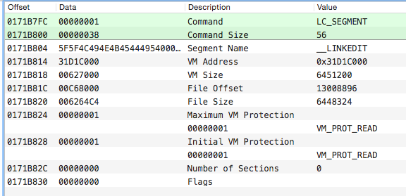

[Mach-O 资料](https://github.com/bx/machO-tools)

[mach-o 读取symbol](http://ho.ax/tag/mach-o/)

[Fackbook hook](https://github.com/facebook/fishhook)

[Apple OS X ABI Mach-O File Format Reference](https://developer.apple.com/library/mac/documentation/DeveloperTools/Conceptual/MachORuntime/index.html#//apple_ref/doc/uid/20001298-96661)

[Let's Build A Mach-O Executable](https://mikeash.com/pyblog/friday-qa-2012-11-30-lets-build-a-mach-o-executable.html)

[Dynamic Link on OS](https://mikeash.com/pyblog/friday-qa-2012-11-09-dyld-dynamic-linking-on-os-x.html)

[List symbols in shared library](https://github.com/clear-code/list-symbols-in-shared-library/blob/master/list-mach-o-32-public-function-names.c)

[WebCore 文件](http://www.opensource.apple.com/source/WebCore/WebCore-955.66/history/PageCache.cpp?txt)

> * LC_SEGMENT — contains different information on a certain segment: size, number of sections, offset in the file and in memory (after the load)
> * LC_SYMTAB — loads the table of symbols and strings
> * LC_DYSYMTAB — creates an import table; data on symbols is taken from the symbol table
 LC_LOAD_DYLIB — defines the dependency from a certain third-party library
> 

比较重要的Segment
> * __TEXT — the executed code and other read-only data
> * __DATA — data available for writing; including import tables that can be changed by the dynamic loader during lazy binding
> * __OBJC — different information of the standard library of Objective-C language of execution time
> * __IMPORT — import table only for 32-bit architecture (I managed to generate it only on Mac OS 10.5)
> * __LINKEDIT — here, the dynamic loader places its data for already loaded modules (symbol tables, string tables, etc.)
> 

Segment 					|
--------------------  	|
struct load_command		|
struct section			|

