#UITableview Tip


## 1) delegate 和 dataSource 回调时机

在做自媒体人卡片的时候，发现在 iOS 7 和 iOS 8 之后的UITableView 的事件回调机制很不一样，于是踩坑了！
关心的主要回调事件主要有：
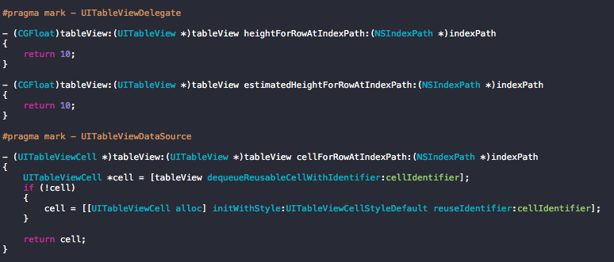

####这几个函数调用的时机主要有：
>1) 调用addSubView方法将UITableView 加入到父视图。
>
>2）TableView 调用 reloadData 方法。
>
>3）滚动TableView。


####在 iOS 7 上，把TableView 加入到父视图实行的方法时序如下：

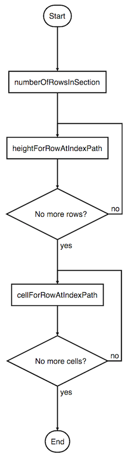


可以发现，系统会在获取每行的cell前，前置拿到所有行的高度。这样，系统才能计算出滚动轴的总高度。而之后在获取cell对象时，并不会重新调用获取该行高度的方法。

####在 iOS 8 上，把TableView 加入到父视图实行的方法时序如下：

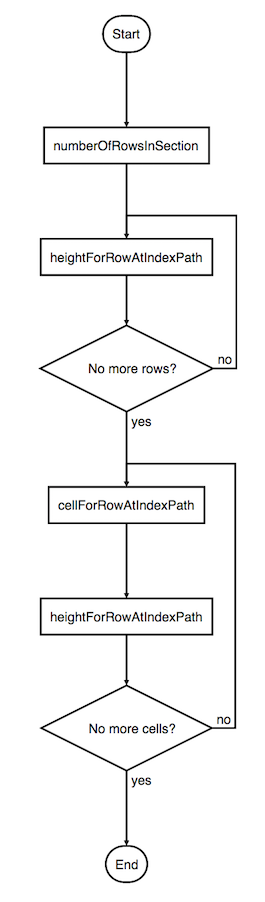


在iOS 7.0上，可以发现，系统会在获取每行的cell前，前置拿到所有行的高度。之后，在获取cell对象时，并不会重新调用获取该行高度的方法。而在iOS 8.0上，在获取cell对象后，会重新调用获取该行高度的方法。这样，就意味着可以在真正产生出cell对象之后，再提供高度。

**这里也是我猜坑的地方，在iOS 7 计算高度的地方，由于在 7 上前置拿到所有cell 高度之后，后面不会再调用heightForRowAtIndexPath 这个方法，导致高度计算出错，解决的办法就是在返回高度的地方强制SetNeedLayout才能获取对的高度！**


在这里，聪明的杀破狼队员们应该发现：什么，在iOS 8 之后，调用cellForRowAtIndexPath 的地方会再调用一次heightForRowAtIndexPath ！ 每次都计算高度，很浪费呀。

左边是iOS 8 ，右边是iOS 7
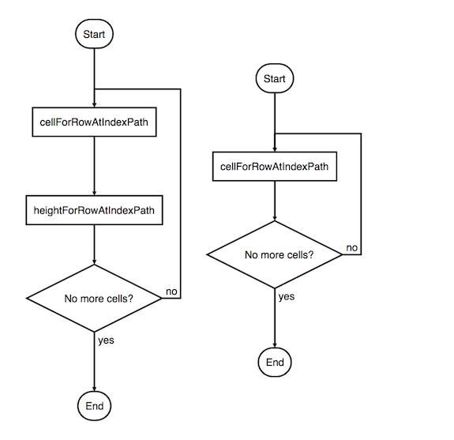

正是因为这个区别，有时候我们发现同样的代码，在 iPhone5 （iOS 7 系统） 比 iPhone 5s （iOS 8 系统）还流畅！WTF

解决的办法是：**Cache it !** 别忘了，横屏和竖屏的高度是不一样的，要分开缓存！不然，测试兄弟又提Bugs 了。

***插个tip:不要cellForRowAtIndexPath:方法中绑定数据，因为在此时cell还没有显示。可以使用UITableView的delegate中的tableView:willDisplayCell:forRowAtIndexPath:方法。***

####heightForRowAtIndexPath 调用次数，在iOS 7 也受estimatedHeightForRowAtIndexPath 函数的影响。
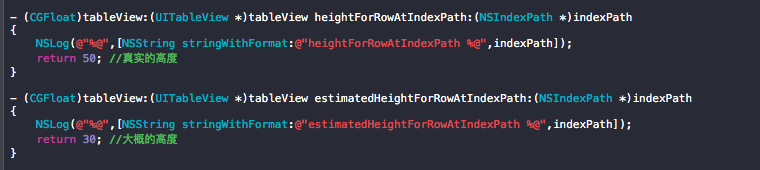

**有图有真相！**
 
当使用estimatedHeightForRowAtIndexPath 的时候，系统只会调用heightForRowAtIndexPath。
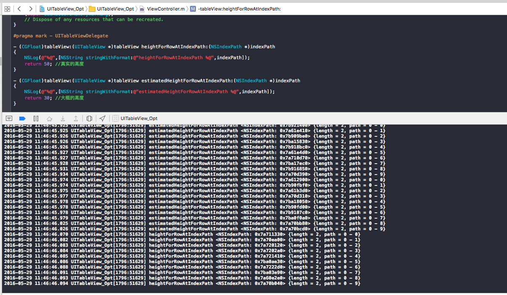

当没有使用estimatedHeightForRowAtIndexPath 的时候，系统只会调用heightForRowAtIndexPath。

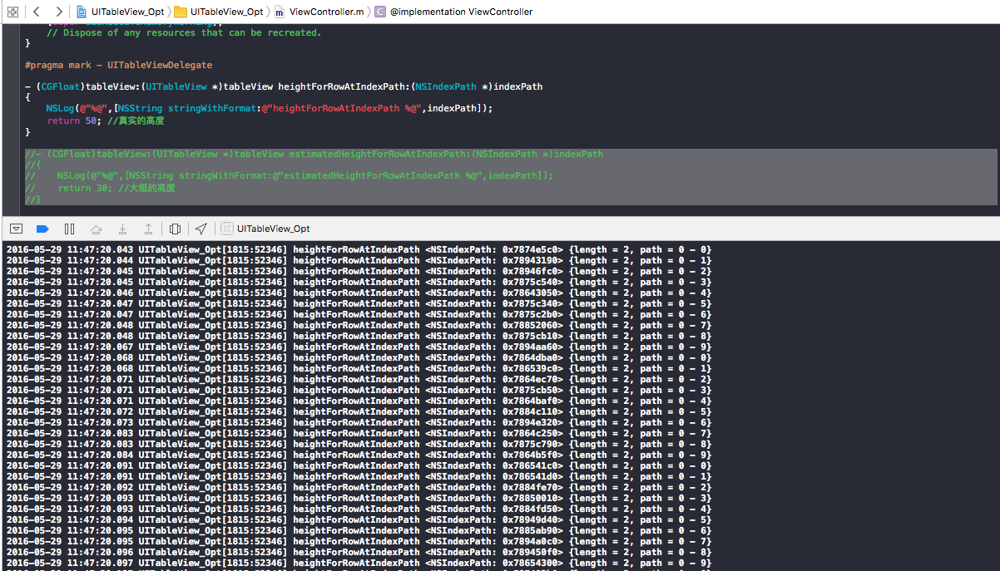

**通过结果可以看到，加载时会先通过 estimatedHeightForRowAtIndexPath 处理全部数据，此时只需要返回一个粗略的高度，待到Cell加载时才去调用原有的真实高度的回调方法，且只会处理屏幕范围内的行，这样当数据非常多时，会显著的提升加载的性能**

##2）让高度计算不再成为负担


基于这些TableView 的特点，在设置cell 的时候，是否可以提前异步计算每一个cell 的高度，然后缓存起来呢？
这不是废话吗？肯定可以啦！


有三种类型的cell ，如下图

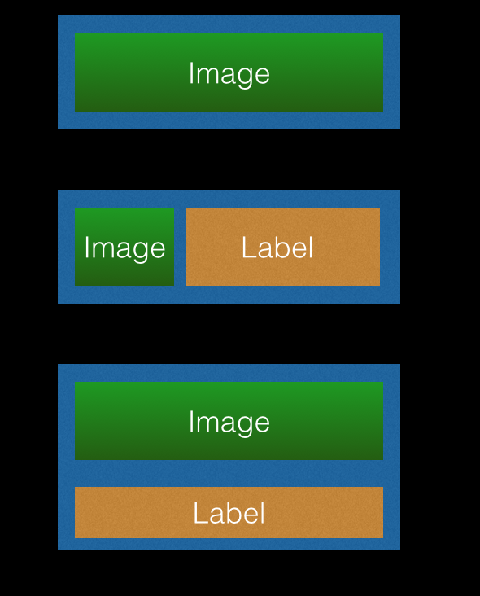

假设注册了三种类型的cell，第一，第二种cell 的高度是固定的。第三种cell 的高度根据底部label 的高度变化而变化。聪明的你一定会想到，根据数据的类型，返回对应的高度就可以啦。对于第三种类型，计算文字的高度再返回。So far so good!


代码大概长这个样子：

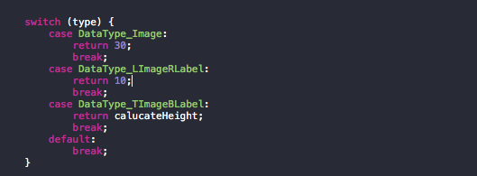


过几天，UI 觉得不好看，改一下UI 把。

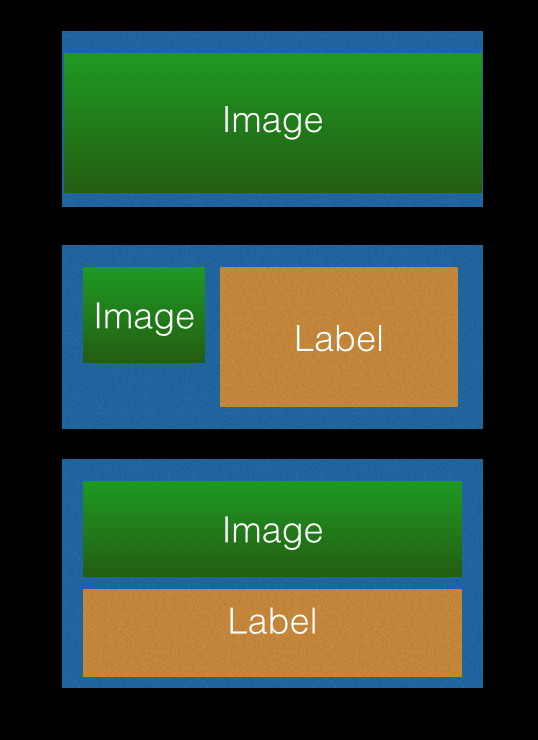

一次两次的改动，修改是很快的。当业务越来越复杂的时候，cell 的类型越来越多的时候，一些layout 的代码也变得很难看。我的解决办法是：通过为每一种cell 配置一个专门用于保存配置信息的类。LayoutoutAttribute.通过layoutAttribute ,可以知道类型1 的cell ，它主要就是图片的上下左右边距的调整，通过设置layoutAttribute ，返回对应UIEdgeInsets 。这样就可以了，不用再修改layoutSubView 里面的代码。多爽！

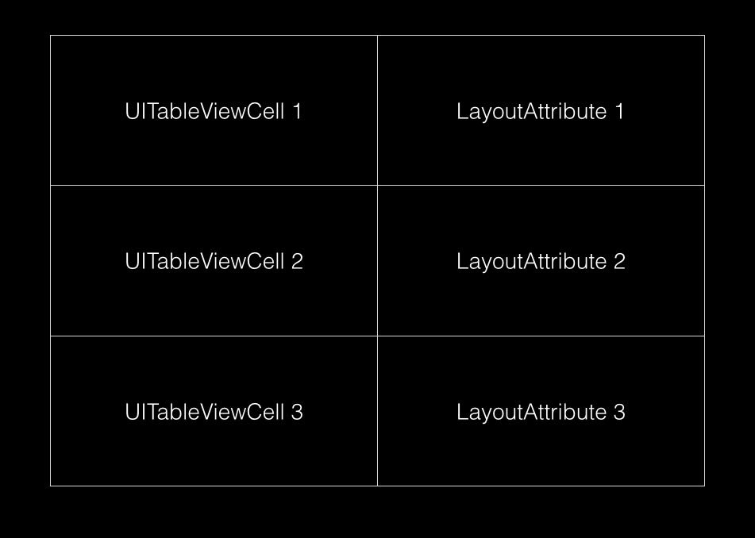


结合Cell的数据，生成对应的LayoutAttribute 就可以确定对应的Cell的 高度！简单一句就是：TableView的数据有了，高度也就有了。这里可以异步的计算高度，具体怎么做，你懂的啦！

通过使用estimatedHeightForRowAtIndexPath 和 高度预计算，可以大大提升TableView  的滚动效率！还觉得不够！继续往下看！

##3) 图片加载时机优化

按照用户的操作习惯，当用户快速滑动列表的时候，在没有滚动到目标位置之前，tableView 中的图片是不需要下载的。通过观察ScrollView的回调可以轻松做到这一点。先来看看ScrollView的一些回调和特性。

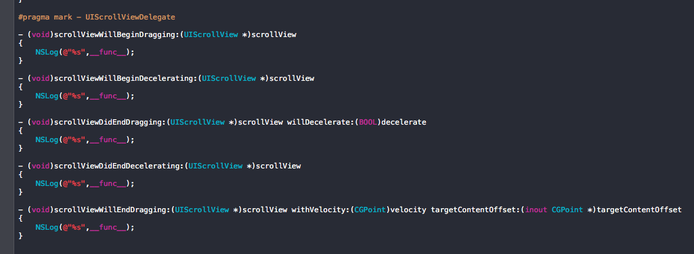

按照一般的操作习惯，回调函数时序会有三种：
>1) 用户滑动列表一次
>
>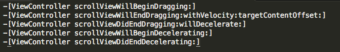
>
>2）用户两次次滑动列表
>
>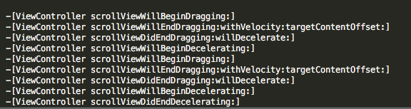
>
>3）用户两次滑动列表，第二次停止加速滑动（就是用手指把scrollView 停住）
>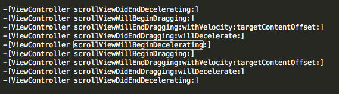
>

通过观察第二和第三种情况，发现新的 dragging 如果有加速度，那么 willBeginDecelerating 会再一次被调用，然后才是 didEndDecelerating；如果没有加速度，虽然 willBeginDecelerating 不会被调用，但前一次留下的 didEndDecelerating 会被调用，所以连续快速滚动一个 scroll view 时，delegate 方法被调用的顺序就是2和3 两种情况交替出现。

**刚开始拖动的时候，dragging 为 YES，decelerating 为 NO；decelerate 过程中，dragging 和 decelerating 都为 YES；decelerate 未结束时开始下一次拖动，dragging 和 decelerating 依然都为 YES。所以无法简单通过 table view 的 dragging 和 decelerating 判断是在用户拖动还是减速过程。**

**通过添加一个变量如 userDragging，在 willBeginDragging 中设为 YES，didEndDragging 中设为 NO。加载图片的时机可以是userDragging 为YES 和 tableView的decelerating 属性为YES.**

遇到一些大图下载的需求，可以通过这种方法来提升TableView 的性能。

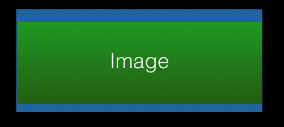

##4) 数据内存优化

仿效于CoreData 属性，当一些没有用到的数据，不需要加载到内存。这里可以使用数据虚拟化，简单来说就是。
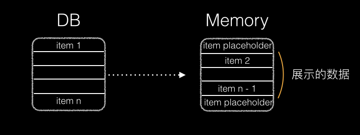

在内存中，不全是真的数据类型，item placeholder是一个自定义的数据类型，item 是真实的数据类型。展示的数据就相当于一个窗口，会上下浮动。不再窗口内的数据，可以直接释放掉，节省内存，在窗口内的数据则从本地DB 中读取。

**在这里聪明的你，应该会想到：提前异步加载窗口内的数据，当cell 要使用的时候，直接可以在内存获取。**这里可以结合ScrollView 的特性实现数据预加载。

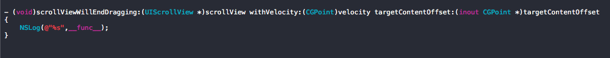

targetContentOffset 是tableView 减速到停止的地方。通过判断当前数据的位置，可以实现数据预加载！

##5) 对CPU 和 GPU 都应该公平点！
优化UITableView 的流畅性，不单单是time profile 看手机CPU 的利用率就可以的。别忘了，它还有个兄弟：GPU。什么情况下会触发GPU，让它工作呢？先来看看两者的主要工作。

###CPU
> * 对象的创建与销毁
> * 布局计算（frame,bound ,etc）
> * 文本计算 （[NSAttributedString boundingRectWithSize:options:context:] 计算文字高度）
> * 文本渲染 （UITextView ,UILabel, CoreText）
> * 图片的解码 (这个不用说啦，大家都懂)
> * 图像的绘制 (DrawRect)


###GPU
> * 纹理的渲染  （所有的 Bitmap，包括图片、文本、栅格化的内容，最终都要由内存提交到显存，绑定为 GPU Texture）
> * 视图的混合 （多层次的view 或者layer 叠加）
> * 图形的生成（圆角、阴影、遮罩。最典型的图片圆角问题！）

针对自媒体人卡片的情况，我们来分析一下。卡片类型中有一种比较复杂的情况是这样的。
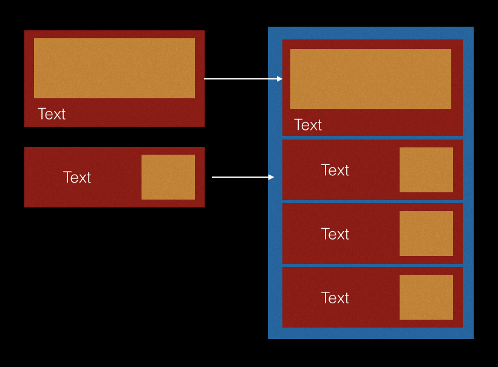
 
 在这里可以看出一个严重的问题：会存在多层View的叠加。看看上面提到的，多层view 的叠加，如果处理不好，处了会增加CPU 的负担。还会增加GPU 的负担！Holy shit,目前项目中还没有处理这种情况。
 
通过Instrument观察到，CPU 的利用率不高，但是GPU的利用率就飙升！ 我们要对CPU 和 GPU 公平一点，把一些可以分担给CPU 的工作都分出去。
处理方法：把叠加的Views ,绘制成一张图片！利用CPU 来绘制图像。

这里有个关键点：你需要清楚地知道哪部分渲染需要使用GPU，哪部分可以使用CPU，以此保持平衡。


##6)关于像素的问题
之前同事国星发现了一个UILabel 的问题，当UILabel的坐标存在很小的小数时，Label 的字体会模糊。例如：CGRectMake(21.0023, 60, 200, 50)，这样就会出现字体模糊。

深挖一下， 其实就是iOS 的sub pixel anti aliasing. AKA ,像素的抗锯齿。什么情况下会出现这种不必要的子像素抗锯齿操作呢？最常发生的情况是通过代码计算而变成浮点值的视图坐标，已经踩过坑！或者是一些不正确的图片资源，这些图片的大小不是对齐到屏幕的物理像素上的（例如，你有一张在Retina显示屏上的大小为60*61的图片，而不是60*60的）。

像素模糊问题，靠人眼是很难看出区别的。不是每个人都像我一样，有像素眼。这个时候，可以用Instruments 来检测。非常简单，只需要在Core Animation里面开启Color misaligned Images就可以了。

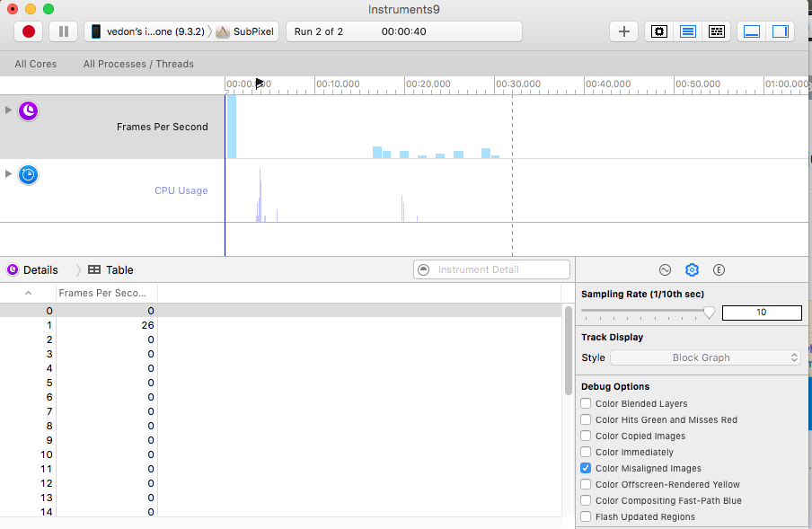

##然后我们看个例子：


黄色部分就是图片没有对齐的问题，品红色就是像素没对齐。
图片中的设备是iPhone 5c ,坐标为21和21.5 没有像素对齐的问题，因为0.5 就是一个像素嘛。当座位改为21.2，这个时候就悲剧了，屏幕为了可以显示这个坐标的字体，就发生了sub pixel antialiased. 严重的，就会出现字体模糊的问题。

再来看看下面的图片，第一张图片的大小是200 ＊ 200 pixels ，也就是程序里面的CGSizeMake(100, 100)。图片的大小刚好可以对齐imageView的大小。另外一张图，90 ＊ 90 pixels ,也就是程序里面的CGSizeMake(45, 45).当imageView 设为CGSizeMake(90, 90)，就会有图片对齐的问题。

以上两种问题都会消耗GPU！影响帧率！

以上两种问题都会消耗GPU！影响帧率！

以上两种问题都会消耗GPU！影响帧率！

###解决的办法
像素对齐的问题，只需要简单的使用ceilf, floorf和CGRectIntegral方法来对坐标做四舍五入处理。

图片对齐的问题，就需要重绘图片了。

```objc
- (UIImage *)cropEqualScaleImageToSize:(CGSize)size {
    CGFloat scale =  [UIScreen mainScreen].scale;
  
  UIGraphicsBeginImageContextWithOptions(size, NO, scale);
  
  CGSize aspectFitSize = CGSizeZero;
  if (self.size.width != 0 && self.size.height != 0) {
    CGFloat rateWidth = size.width / self.size.width;
    CGFloat rateHeight = size.height / self.size.height;
    
    CGFloat rate = MIN(rateHeight, rateWidth);
    aspectFitSize = CGSizeMake(self.size.width * rate, self.size.height * rate);
  }
  
  [self drawInRect:CGRectMake(0, 0, aspectFitSize.width, aspectFitSize.height)];
  UIImage *image = UIGraphicsGetImageFromCurrentImageContext();
  UIGraphicsEndImageContext();
  
  return image;
}
```

关于字体的相关链接：

[字体渲染背后不得不说的故事](http://www.jianshu.com/p/8414b96549e3)

[Sub pixels antialiased](https://bjango.com/articles/subpixeltext/)