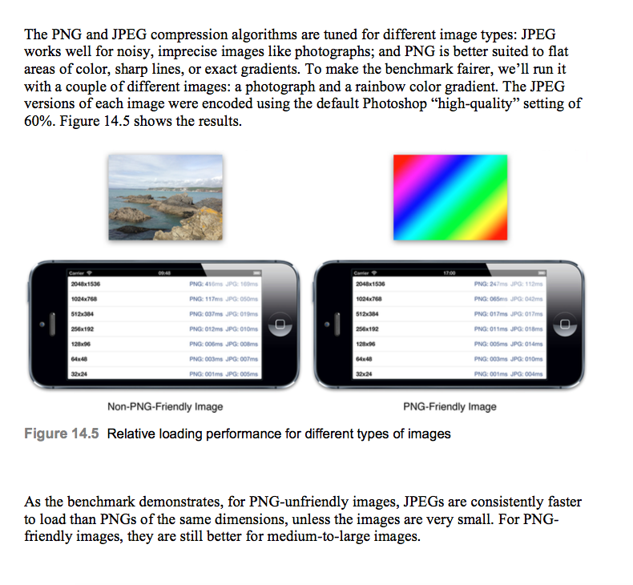
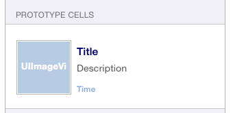

#iOS 图片加载优化

首先系统从磁盘加载一张图片，并使用UIImageView 来显示，需要经过以下步骤：

> * 从磁盘拷贝图片数据到内核缓冲区
> 
> * 从内核缓冲区复制数据到用户空间
> 
> * 把图像数据赋值给UIImageView ，如果图片数据为没有解码的png / jepg 格式，会先解码为[位图数据](http://www.raywenderlich.com/69855/image-processing-in-ios-part-1-raw-bitmap-modification)
> 
> * 图像渲染。


##从磁盘拷贝图片数据到内核缓冲区

这一项是由iOS 内核决定的，应用程序无法干扰，也不需要处理。


##从内核缓冲区复制数据到用户空间
现在操作系统将操作系统的核心代码与应用程序，用户运行的服务程序分离。任何作为内核的一部分运行代码（如驱动程序），都需要在```内核空间```运行。运行在内核空间的代码拥有特殊的权限，如可以直接的写链接在计算机上的硬件设备等。

用户处理的标准的应用程序代码要在用户空间中运行。```用户空间```中的运行的软件无法直接访问硬件，如我们在磁盘读取图片的时候，因此，用户空间会向内核发起请求，让内核代表应用程序执行任务。并且内核把图片数据读入内核缓冲区，用户再从内核缓冲区读取数据复制到用户内存空间，这里有一次内存拷贝的时间消耗，并且读取后整个文件数据就已经存在于用户内存中，占用了进程的内存空间。

使用```内存映射```的技术，可以避免数据从内核缓冲区复制到用户空间的性能消耗。内存映射是用mmap把文件映射到用户空间里的虚拟内存，文件中的位置在虚拟内存中有了对应的地址，可以像操作内存一样操作这个文件，相当于已经把整个文件放入内存，但在真正使用到这些数据前却不会消耗物理内存，也不会有读写磁盘的操作，只有真正使用这些数据时，也就是图像准备渲染在屏幕上时，虚拟内存管理系统VMS才根据缺页加载的机制从磁盘加载对应的数据块到物理内存

[FastImageCache](https://github.com/path/FastImageCache#what-fast-image-cache-does)使用了内存映射技术等，加快了图片的加载。

**FastImageCache** 由Path工程师开发，可以帮app更快更有效率的储存并检索图片的工具。它在图片处理上做了些什么呢？
> * 同一风格或者尺寸的图片存储在一起
> * 将图片解码后的bitmap，缓存在本地
> * 运用LRU 算法来管理图片的缓存
> * 生成图片数据的时候，使图片的字节对齐，避免了Core Animation 的拷贝操作。
> * 使用mmap 进行磁盘的I/O 操作。

FastImageCache 采用的是 mmap 将文件映射到内存。缺陷是：数据的文件超过内存大小时，会导致内存交换严重降低性能，不过一般这种情况比较少；另外内存中的数据是定时 flush 到文件的，如果数据还未同步时程序挂掉，就会导致数据错误。


参考链接：

[FastImageCache 解析](http://blog.cnbang.net/tech/2578/)

[Creating a Bitmap Graphics Context](https://developer.apple.com/library/ios/documentation/GraphicsImaging/Conceptual/drawingwithquartz2d/dq_context/dq_context.html#//apple_ref/doc/uid/TP30001066-CH203-CJBHBFFE)

[How CacheLine affect the performance of loading data](http://stackoverflow.com/questions/23790837/what-is-byte-alignment-cache-line-alignment-for-core-animation-why-it-matters)

[Apple iPhone CPU](https://zh.wikipedia.org/wiki/%E8%98%8B%E6%9E%9CA8)

##把图像数据赋值给UIImageView ，如果图片数据为没有解码的png / jepg 格式，会先解码为位图数据


**加载图片的方式**
> * ```imageWithName:``` 加载图片之后会立刻进行解码，并由系统缓存图片解码后的数据。但是```imageWithName```方法只能用于加载在程序资源目录下的图片。由于解码后的图片是由系统来缓存的，因此也没办法决定什么时候将图片移除，也不能设置缓存大小。
> 
> * ```imageWithContentsOfFile:``` 加载图片后，不进行解码。不缓存图片
> 
> * ```CGImageSourceCreateImageAtIndex:``` 加载图片后，进行解码，通过设置kCGImageSourceShouldCache ，可以在图片的生命周期内，保存图片解码后的数据。
 

```
NSURL *imageURL = [NSURL fileURLWithPath:filePath];
NSDictionary *options = @{(__bridge id)kCGImageSourceShouldCache: @YES}; 
CGImageSourceRef source = CGImageSourceCreateWithURL((__bridge CFURLRef)imageURL, NULL);
CGImageRef imageRef = CGImageSourceCreateImageAtIndex(source, 0,(__bridge CFDictionaryRef)options);
UIImage *image = [UIImage imageWithCGImage:imageRef]; 
CGImageRelease(imageRef);
CFRelease(source);
```


> * 使用UIKit 重绘图片，实现强制解码。图片不缓存 


```
UIGraphicsBeginImageContextWithOptions(imageView.bounds.size, YES, 0);
[image drawInRect:imageView.bounds];
image = UIGraphicsGetImageFromCurrentImageContext();
UIGraphicsEndImageContext();
```  
 

**自定义缓存**
> * NSCache  基本上就是一个会自动移除对象来释放内存的 NSMutableDictionary。和字典不同的是，它会在系统内存紧张的时候丢弃存储的对象。NSCache是线程安全的，我们可以在不同的线程中添加、删除和查询缓存中的对象，而不需要锁定缓存区域。而且它不像NSMutableDictionary对象，一个缓存对象不会拷贝key对象。
>
>  推荐一个个人觉得很好用的缓存框架：[TMCache](https://github.com/tumblr/TMCache)


**图片的压缩格式** 
>
主要来看看[png](https://zh.wikipedia.org/wiki/PNG) 和 [jpeg](https://zh.wikipedia.org/wiki/JPEG) 这两种压缩格式吧。对于PNG图片来说，加载会比JPEG更长，因为文件可能更大，但是解码会相对较快，而且Xcode会把PNG图片进行解码优化之后引入工程。JPEG图片更小，加载更快，但是解压的步骤要消耗更长的时间，因为JPEG解压算法比基于zip的PNG算法更加复杂。
> 
> jpeg 对于噪点大的图片效果比较好，png 适合锋利的线条或者渐变色的图片。对于不友好的png图片，相同像素的JPEG图片总是比PNG加载更快，除非一些非常小的图片、但对于友好的PNG图片，一些中大尺寸的图效果还是很好的。
> 
> 


##图像渲染
关于图像的渲染，主要从以下三点分析：
> **offscreen rendring**
> 
> **Blending**
> 
> **Rasterize**

**```offscreen rendering```**指的是在图像在绘制到当前屏幕前,需要先进行一次渲染,之后才绘制到当前屏幕。在进行offscreen rendring的时候，显卡需要另外alloc一块内存来进行渲染,渲染完毕后在绘制到当前屏幕,而且对于显卡来说,onscreen到offscreen的上下文环境切换是非常昂贵的(涉及到OpenGL的pipelines和barrier等),

会造成```offscreen rendring```的操作有：
> * layer.mask 的使用
> * layer.maskToBounds 的使用
> * layer.allowsGroupOpacity 设置为yes 和 layer.opacity 小于1.0
> * layer.shouldRasterize 设置为yes
> * layer.cornerRadius,layer.edgeAntialiasingMask,layer.allowsEdgeAntialiasing


**```Blending```** 会导致性能的损失。在iOS的图形处理中,blending主要指的是混合像素颜色的计算。最直观的例子就是,我们把两个图层叠加在一起,如果第一个图层的透明的,则最终像素的颜色计算需要将第二个图层也考虑进来。这一过程即为Blending。更多的计算，导致性能的损失，在一些不需要透明度的地方，可以设置alpha 为1.0 或者减少 图层的叠加。


**```Rasterize```**启用shouldRasterize属性会将图层绘制到一个屏幕之外的图像。然后这个图像将会被缓存起来并绘制到实际图层的contents和子图层。如果有很多的子图层或者有复杂的效果应用，这样做就会比重绘所有事务的所有帧划得来得多。但是光栅化原始图像需要时间，而且还会消耗额外的内存。
当我们使用得当时，光栅化可以提供很大的性能优势但是一定要避免作用在内容不断变动的图层上，否则它缓存方面的好处就会消失，而且会让性能变的更糟。

图片渲染可以异步的执行，但是有没有遇到当使用tableview 来显示渲染后的内容,添加到```contentView```，```NSString```的sizeWithAttributes,sizeWithFont 和计算cell高度的```systemLayoutSizeFittingSize``` 等都是要在主线程执行的。主线程忙碌会影响用户体验，特别是滚动tableView的时候.



把Cell 的content 分解为内容和渲染的方法。内容就是：UIImageView ,Labels。渲染的方法就是为UIImageView 准备图片，为Labels 准备要显示的文字。涉及到渲染的东西一般都是都可以在子线程执行，而内容一般要在主线程执行。在主线程空闲的时候，我们可以做一些预加载。

**主线程什么时候空闲呀？？？**

主线程的[RunLoop](https://developer.apple.com/library/ios/documentation/Cocoa/Conceptual/Multithreading/RunLoopManagement/RunLoopManagement.html)的状态是可以通过系统提供的API 获取的。

可被监听的状态有：

```
typedef CF_OPTIONS(CFOptionFlags, CFRunLoopActivity) {
    kCFRunLoopEntry = (1UL << 0),  		//RunLoop 开始
    kCFRunLoopBeforeTimers = (1UL << 1),//将要执行timer
    kCFRunLoopBeforeSources = (1UL << 2),//将要执行Source
    kCFRunLoopBeforeWaiting = (1UL << 5),//将要睡眠了
    kCFRunLoopAfterWaiting = (1UL << 6), //被唤醒了
    kCFRunLoopExit = (1UL << 7),			 //RunLoop退出
    kCFRunLoopAllActivities = 0x0FFFFFFFU
};
```

```
CFRunLoopRef runLoop = CFRunLoopGetCurrent();
CFStringRef runLoopMode = kCFRunLoopDefaultMode;
CFRunLoopObserverRef observer = CFRunLoopObserverCreateWithHandler
(kCFAllocatorDefault, kCFRunLoopBeforeWaiting, true, 0, ^(CFRunLoopObserverRef observer, CFRunLoopActivity _) {
    // 在这里处理预加载
});
CFRunLoopAddObserver(runLoop, observer, runLoopMode);
```
最后调用CFRunLoopRemoveObserver 移除观察者，调用CFRelease 释放观察者。
