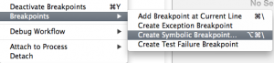
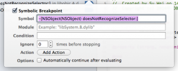

UNRECOGNIZED SELECTOR SENT TO INSTANCE 问题快速定位的方法
五月 7, 2014 ROBOT	3条评论
开发中常见的一类崩溃错误是遇到：unrecognized selector sent to instance 0xaxxxx…而backtrace又无法明确说明错误在哪行代码，如何快速定位BUG呢？

有时读代码一下很难找到是哪个instance出的问题，这时定制有效的DEBUG断点是最好的办法，方法如下：

在Debug菜单中选择 Breakpoints -> Create Symbolic Breakpoint…

	
-[NSObject(NSObject) doesNotRecognizeSelector:]

然后再运行复现错误时断点会停在真正导致崩溃的地方。